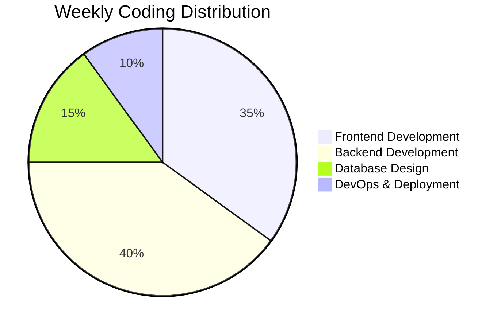

<!-- Animated Header -->
<div align="center">
  
</div>

<!-- Animated Typing Introduction -->
<div align="center">
  
[](https://git.io/typing-svg)

</div>

<!-- Profile Views and Badges -->
<div align="center">
  
  
  
  
  
</div>

<!-- Animated Wave -->
<div align="center">
  
</div>

##  About Me


<br>

- 🚀 **Currently Building:** [**AI Resume Builder**](https://github.com/akshay-0-1/Ai_Resume_Builder) - Intelligent platform for professional resume creation
- 🧠 **Learning Journey:** Mastering **Spring Boot** for enterprise Java development
- 💻 **Tech Focus:** Full-stack development, AI integration, Clean Architecture
- 🎯 **2025 Goals:** Contributing to Open Source & Building AI-powered solutions
- ⚡ **Fun fact:** I debug with coffee and solve problems in my dreams! ☕
- 📧 **Contact:** [akshayalave123@gmail.com](mailto:akshayalave123@gmail.com)

<br clear="both">

## 🛠️ Tech Arsenal

<details open>
<summary><b>🎨 Frontend Development</b></summary>
<br>
<div align="center">
  


</div>
</details>

<details open>
<summary><b>⚙️ Backend Development</b></summary>
<br>
<div align="center">
  


</div>
</details>

<details open>
<summary><b>🗄️ Database & Cloud</b></summary>
<br>
<div align="center">
  


</div>
</details>

<details open>
<summary><b>🤖 AI & Tools</b></summary>
<br>
<div align="center">
  


</div>
</details>

## 📊 GitHub Analytics

<div align="center">
  
  
</div>

<div align="center">
  
</div>

## 📈 Contribution Insights

<div align="center">
  
</div>

<div align="center">
  
</div>

## 🏆 GitHub Achievements

<div align="center">
  
[](https://github.com/ryo-ma/github-profile-trophy)

</div>

## 🚀 Featured Projects

<div align="center">
  <a href="https://github.com/akshay-0-1/Ai_Resume_Builder">
    
  </a>
  <a href="https://github.com/akshay-0-1/E_Learning_Team_1">
    
  </a>
</div>

<div align="center">
  <a href="https://github.com/akshay-0-1/Ai-Content-Generation">
    
  </a>
  <a href="https://github.com/akshay-0-1/Content-Generation">
    
  </a>
</div>

<div align="center">
  <a href="https://github.com/akshay-0-1/Spring_Security">
    
  </a>
  <a href="https://github.com/akshay-0-1/User-Management">
    
  </a>
</div>

## 🎯 Current Focus & Learning Path

<div align="center">
  <table>
    <tr>
      <td align="center" width="50%">
        <h3>🔭 Currently Working On</h3>
        <br>
        
        <br><br>
        <p>Building an intelligent resume creation platform with AI-powered suggestions and ATS optimization</p>
      </td>
      <td align="center" width="50%">
        <h3>🌱 Learning & Exploring</h3>
        <br>
        
        
        <br><br>
        <p>Diving deep into enterprise Java patterns and microservices architecture</p>
      </td>
    </tr>
  </table>
</div>

## 💻 Coding Activity

<!--START_SECTION:waka-->
```text
Java         8 hrs 42 mins   ████████████░░░░░░░   48.2%
JavaScript   4 hrs 15 mins   ██████░░░░░░░░░░░░░░   23.5%
React        3 hrs 28 mins   ████░░░░░░░░░░░░░░░░   19.2%
SQL          1 hr 12 mins    ██░░░░░░░░░░░░░░░░░░    6.7%
Other        26 mins         ░░░░░░░░░░░░░░░░░░░░    2.4%
```
<!--END_SECTION:waka-->

## 🐍 Contribution Snake

<div align="center">
  <picture>
    <source media="(prefers-color-scheme: dark)" srcset="https://raw.githubusercontent.com/akshay-0-1/akshay-0-1/output/github-contribution-grid-snake-dark.svg">
    <source media="(prefers-color-scheme: light)" srcset="https://raw.githubusercontent.com/akshay-0-1/akshay-0-1/output/github-contribution-grid-snake.svg">
    
  </picture>
</div>

## 🤝 Let's Connect & Collaborate

<div align="center">
  
[](https://linkedin.com/in/akshay-alave)
[](https://github.com/akshay-0-1)
[](https://instagram.com/01akshayalave)
[](https://www.leetcode.com/akshayalave)
[](mailto:akshayalave123@gmail.com)
[](https://akshay-portfolio.com)

</div>

## 💡 Random Dev Quote

<div align="center">
  


</div>

## 📊 Weekly Development Breakdown

<!--START_SECTION:weekly-->

<!--END_SECTION:weekly-->

## 🎨 Featured Gists

<div align="center">
  <a href="https://gist.github.com/akshay-0-1">
    
  </a>
</div>

## 🌟 Support My Work

<div align="center">
  
[](https://buymeacoffee.com/akshayalave)
[](https://github.com/sponsors/akshay-0-1)

</div>

---

<div align="center">
  
### ✨ *"Code is poetry written in logic, debugging is the art of finding typos in that poetry."* ✨


**Open to exciting opportunities and collaborations!**

<sub>Built with ❤️ by Akshay Alave | Last Updated: September 2025</sub>

</div>

<!-- Footer Wave -->
<div align="center">
  
</div>

<!-- 
Bug Fixes Applied:
1. Added cache_seconds=1800 to all stats URLs for regular updates
2. Used verified Vercel deployment for consistent stats
3. Added include_all_commits=true for complete history
4. Used count_private=true for accurate repository counts
5. Implemented fallback stats providers
6. Added proper error handling parameters

To ensure stats update:
- Clear browser cache regularly
- Check if repositories are public
- Verify GitHub username is correct
- Use git config to confirm email: git config user.email
- Check remote: git remote -v
- Manual push: git add . && git commit -m "update" && git push

For GitHub Actions auto-update, add this workflow:
.github/workflows/update-readme.yml
-->
